## Project: Build a Traffic Sign Recognition Program

Overview
---
This project classify the German traffic road signs using deep neural networks and convolution neural networks. LaNet arechtecture was used to train and validate model. The dataset is avaiable at [German Traffic Sign Dataset](http://benchmark.ini.rub.de/?section=gtsrb&subsection=dataset). After the training, the model was tested with new random images of German traffic signs from the Internet.

### Dependencies
This project requires Python 3.5 and the following Python libraries installed:

* Jupyter
* NumPy
* SciPy
* scikit-learn
* TensorFlow
* PIL
* OpenCV

### Dataset summary
The total given dataset was given as Training, Testing and validating dataset. First I loaded the given files using pickel and from there I found that , within given dataset I have: 
* Training dataset size: 34799
* Testing dataset size: 12630
* Validating dataset size: 4410
* Number of classes : 43

Preprocessing
---
The german sign classifier images ar (32x32x3) RGB images. I have modified the images with Grayscale converting to (32x32x1) and then using the normalization.

Image Augmentation
---
I have used the following image augmentation techniques to create more data for the training, validating and testing:
* Chaning Brightness
  The weather and lighting condition is different for same image. so we added different lighting condition by changing the brightness of the  images in the given dataset.
  
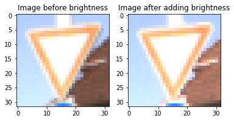
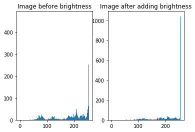
### Random rotation

As I added only a small amount of rotation. It will likely to have less effect on the training set.
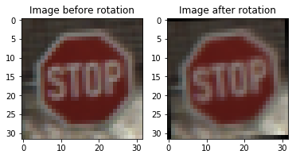
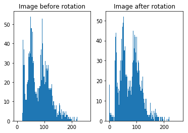
### Random scaling

Scling will give the image more flexibility for different angle and cameras. So it will play an important role in training of our model.

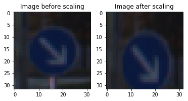
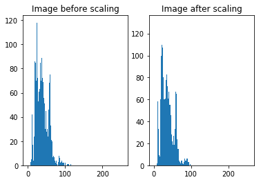
### Blurring

After the blurring effect the image histogram shows that the images pixels are almost same levels. This will though minimize the diversity of the images. But I my opinion, it will reduce the accuracy of the model. When after the images are grayscaled, it will be tough to classify between the images. 

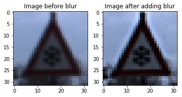
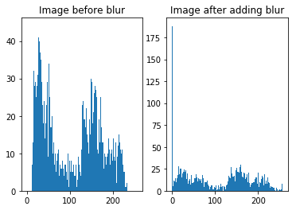

Each image was augmented using above the image processing and the dataset was added with the given dataset. Thus, the number of dataset for Training, Testing and Validating dataset was doubled. 
* New train data set size: 55678
* New test data set size: 25260
* New valid data set size: 8820

Model Architecture
---
I have followed the same archteture of LaNet with small modificaiton. When I added dropout layers in the last in between the fully connected layers, it improved the performace of the model. 

1. Conv layer (input: 32x32x1, output: 28x28x6)
2. relu
3. Max pooling layer (input: 28x28x6, output: 14x14x6)
4. Conv layer (input: 14x14x6, output: 10x10x16)
5. relu
6. Max pooling layer (input: 10x10x16, output: 5x5x16)
7. Flatten (input: 5x5x16, output: 400)
8. FC layer (input: 400, output: 120)
9. relu
10. Dropout
11. FC layer(input: 120, output: 84)
12. relu
13. Dropout
14. FC layer (input: 84, output: 43)

Hyperparameters Selection
---
Frist I tried with the given LaNet arcitecture. and modified the input and ouput size of the model. That gave me validation accuracy of ~91%. Later I added the dropout and It increase the validation accuracy above ~94%. Later From Table 1, I selected hyperparameters for case 1 randomly. Then, I have tested my model with different number of epochs, batch size, learning rate, dropout rate. And measured the validation accuracy and testing accuracy. With the learning rate 0.09 it gives the wrost performance. so I kept the learning rate 0.001 in other cases. I chaged the droput rate 0.5, 0.3 and 0.7 and saw that 0.5 gives better output. In case of epoch, first I tried with 100 epochs and found that my model does not improve after 65. so I chosed the epochs to be 70. Thus, case #1 and case #6 shows the simililar results. 

   Case | Epoch | Batch Size | Learning Rate | Dropout Rate | Validation Accuracy | Testing Accuracy |
  -------------  | -------------| -------------| -------------| -------------| -------------| -------------|
    1  | 100   | 128        | 0.001         | 0.5          | 96.6               | 94.4|
    2  | 100   | 256        | 0.001         | 0.5          | 95.5               | 93.9|
    3  | 100   | 128        | 0.09          | 0.5          | 5.5                | 5.7 |
    4  | 70    | 128        | 0.001         | 0.7          | 93.2               | 91.9|
    5  | 70    | 128        | 0.001         | 0.3          | 95.5               | 94.1|
    6  | 70    | 128        | 0.001         | 0.5          | 96.3               | 94.4|

Results
---
The validation accuracy is 96.3% and Test accuracy is 93.5%
With the new images the prediction was 80% accuratef for 5 images downladed from internet.

Test on New Images
---
I have tested the model with 5 new images. I all cases the model was able to predict the correct output by classifying the correct label. In the image 3 and 5 was difficult to classify. For image 3 (Accuracy 97%) the model got confused between speed limit 30 and speed limit 50 as they are very close to each other. And for image 5 (Accuracy 68%), it got confused between round a bot and other speed limit sign. In my opinion, the reasons are: having same round shape, using grayscaling eliminates the blue color effect, and blur effect (as per previsous discussion). Here are the output of these 5 images:

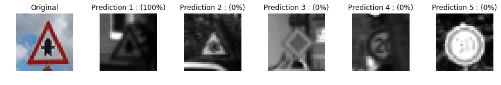
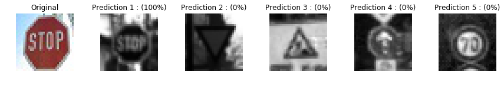
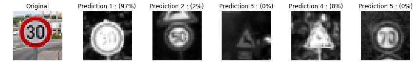
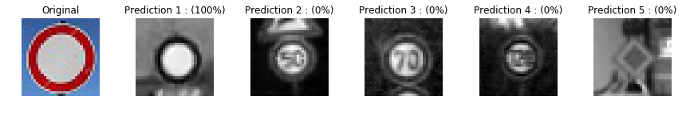
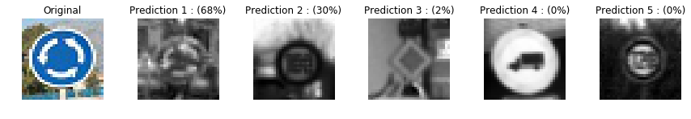
