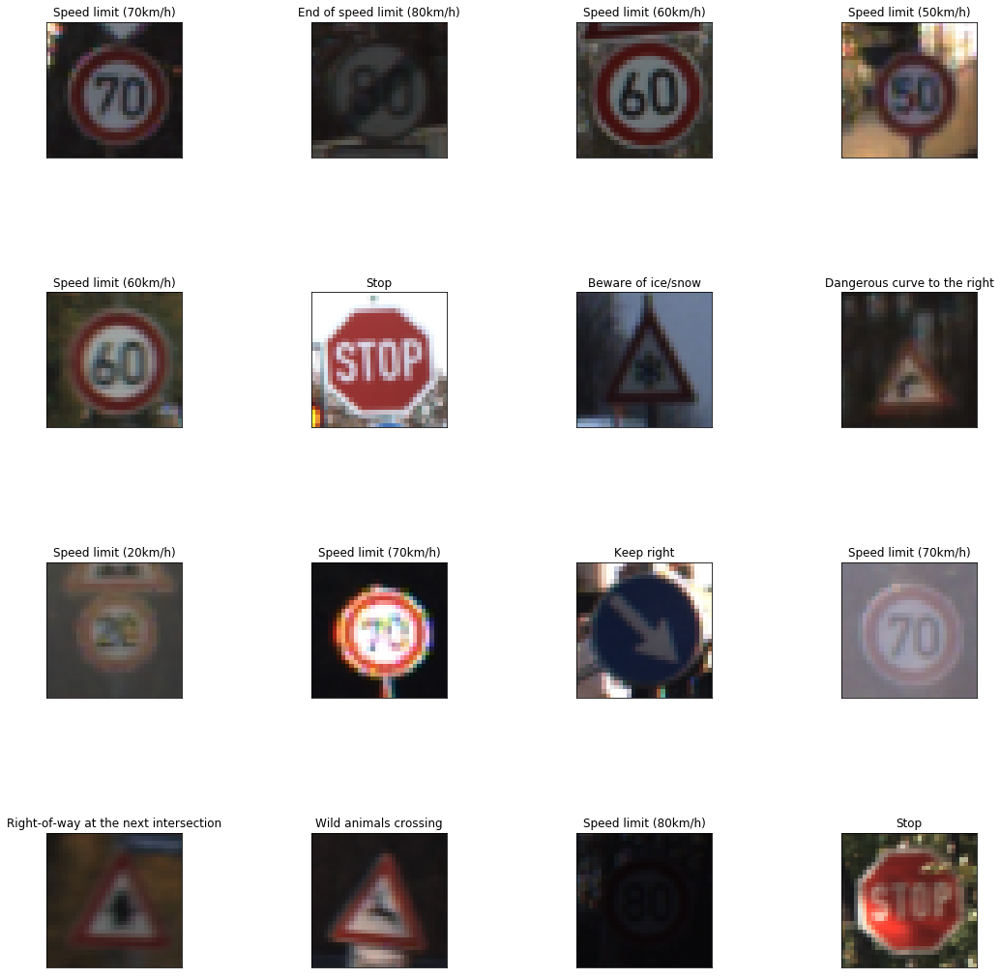
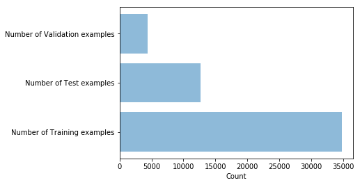
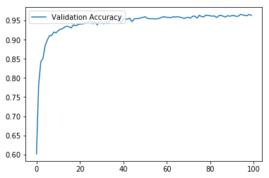

## Project: Build a Traffic Sign Recognition Program

Overview
---
This project classify the German traffic road signs using deep neural networks and convolution neural networks. LaNet arechtecture was used to train and validate model. The dataset is avaiable at [German Traffic Sign Dataset](http://benchmark.ini.rub.de/?section=gtsrb&subsection=dataset). After the training, the model was tested with new random images of German traffic signs from the Internet.

### Dependencies
This project requires Python 3.5 and the following Python libraries installed:

* Jupyter
* NumPy
* SciPy
* scikit-learn
* TensorFlow
* PIL
* OpenCV

### Dataset summary
The total given dataset was given as Training, Testing and validating dataset. First I loaded the given files using pickel and from there I found that , within given dataset I have: 
* Training dataset size: 34799
* Testing dataset size: 12630
* Validating dataset size: 4410
* Number of classes : 43
![alt text][image1]

Preprocessing
---
The german sign classifier images ar 32x32x3 RGB images. I have modified the images with Grayscale converting to 32x32x1 and then using the normalization.

Image Augmentation
---
I have used the following image augmentation techniques to create more data for the training, validating and testing:
* Chaning Brightness
* Random rotation
* Random scaling
* Blurring

Model Architecture
---
1. Conv layer (input: 32x32x1, output: 28x28x6)
2. relu
3. Max pooling layer (input: 28x28x6, output: 14x14x6)
4. Conv layer (input: 14x14x6, output: 10x10x16)
5. relu
6. Max pooling layer (input: 10x10x16, output: 5x5x16)
7. Flatten (input: 5x5x16, output: 400)
8. FC layer (input: 400, output: 120)
9. relu
10. Dropout
11. FC layer(input: 120, output: 84)
12. relu
13. Dropout
14. FC layer (input: 84, output: 43)

Results
---
The validation accuracy is 96.3% and Test accuracy is 93.5%
With the new images the prediction was 80% accuratef for 5 images downladed from internet.

